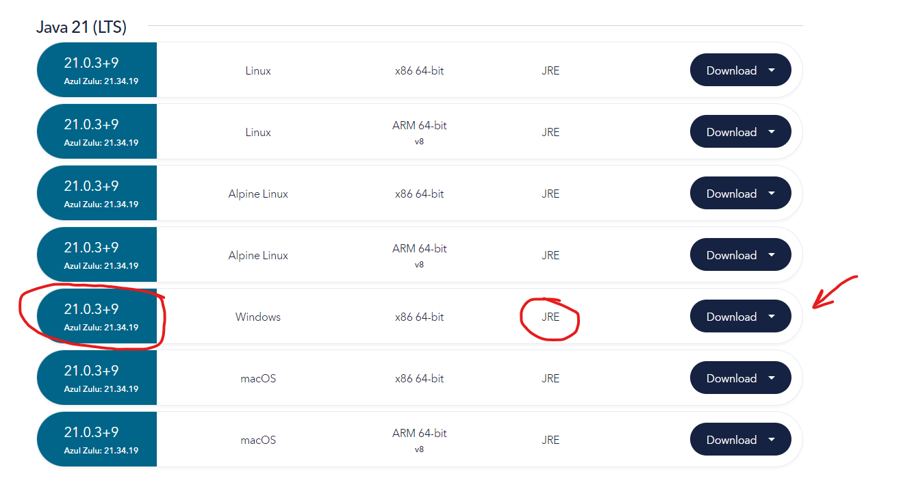

# watermark-desktop v2.0

## About

_Language_: **Java 21 + JavaFx** <br>
_Packaging_: **Maven** <br>
_Executable wrapper_: **launch4j** <br>
_Executable installer (I tried but messed up)_ : **Inno Setup Compiler**

<pre>
This program is made out of [watermark-app] repository which is a web version. 
It puts any png watermark to the image or set of images in format of png, jpeg, jpg.
Special thanks to my friend Max and his videography department for giving me an opportunity 
to create this software for them. Since I made this project for free, 
I have decided to make it open source. :)

</pre>


<div align="center">
    
</div>

## Installation
For current version, I messed up doing an installer, so I made an executable runner.<br>
The only thing you need to do:
1) Download folder ```watermark_user``` 
2) Download JRE 21 from https://www.azul.com/downloads/?package=jdk#zulu

<div align="center">
    
</div>

3) Place everything from downloaded archive to JRE folder

<div align="center">
    
</div>

<div align="center">
    
</div>

4) Run Watermark.exe


